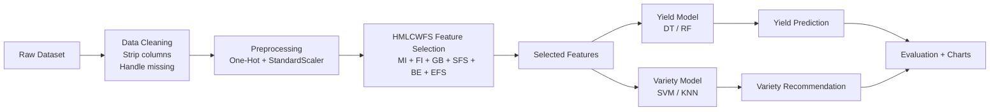

## 一、報告內容說明：
### 本次報告請包含以下三項重點內容：

- 資料欄位說明（Data Field Description）
- 所提出模型之流程圖（Flowchart of Proposed Model）
- 使用演算法之介紹（請以PPT形式呈現並納入報告說明）

---

## 二、資料欄位說明（Data Field Description）

### 1) 目標欄位（Targets）

- Paddy yield(in Kg)：稻作產量（數值型，迴歸目標）
- Variety：品種（類別型，分類目標）

### 2) 類別欄位（Categorical）

- Agriblock：農業區塊
- Soil Types：土壤類型
- Nursery：育苗型態（dry/wet）
- Wind Direction_D1_D30, Wind Direction_D31_D60, Wind Direction_D61_D90, Wind Direction_D91_D120：各生長階段風向

### 3) 數值欄位（Numerical）

- Hectares：農地面積
- Seedrate(in Kg)：播種量
- LP_Mainfield(in Tonnes), LP_nurseryarea(in Tonnes)：有機肥施用量
- Nursery area (Cents)：育苗面積
- DAP_20days, Weed28D_thiobencarb, Urea_40Days, Potassh_50Days, Micronutrients_70Days, Pest_60Day(in ml)：施肥/農藥量
- 30DRain( in mm) ~ 71_105DRain(in mm)：分期降雨量
- 30DAI(in mm) ~ 71_105DAI(in mm)：分期灌溉量
- Min/Max temp_D1_D30 ~ Min/Max temp_D91_D120：各生長階段最低/最高溫
- Inst Wind Speed_D1_D30(in Knots) ~ Inst Wind Speed_D91_D120(in Knots)：各生長階段風速
- Relative Humidity_D1_D30 ~ Relative Humidity_D91_D120：各生長階段相對濕度
- Trash(in bundles)：稻草殘留量

> 備註：欄位名稱保留原始資料集命名，便於對照與重現。

---

## 三、所提出模型之流程圖（Flowchart of Proposed Model）

---

## 四、使用演算法之介紹（PPT 內容大綱）

### Slide 1：問題定義

- 目標一：稻作產量（迴歸）
- 目標二：品種推薦（分類）
- 輸入：農藝 + 氣候特徵（共 43 欄）

### Slide 2：前處理方法

- 類別欄位：One-Hot Encoding
- 數值欄位：StandardScaler
- 缺值：SimpleImputer（median / most_frequent）

### Slide 3：HMLCWFS 多方法特徵篩選

- Filter：Mutual Information (MI)
- Embedded：RandomForest Importance (FI), GradientBoosting Importance (GB)
- Wrapper：Sequential Feature Selector (SFS), Backward Elimination (BE)
- Search Proxy：Permutation Importance (EFS)
- 共識特徵：多方法排名交集/投票

### Slide 4：產量模型（Regression）

- Decision Tree Regressor (DT)
- Random Forest Regressor (RF)
- 指標：RMSE、R2

### Slide 5：品種模型（Classification）

- Support Vector Machine (SVM)
- K-Nearest Neighbors (KNN)
- 指標：Accuracy

### Slide 6：結果與分析

- 特徵重要性視覺化
- 基線 vs 篩選後模型效能比較
- 最佳模型建議（RF、KNN）

> PPT 內容可直接依以上大綱分頁製作，圖表請引用 notebook 產出結果。